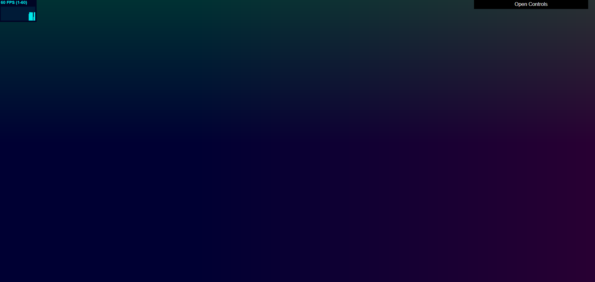
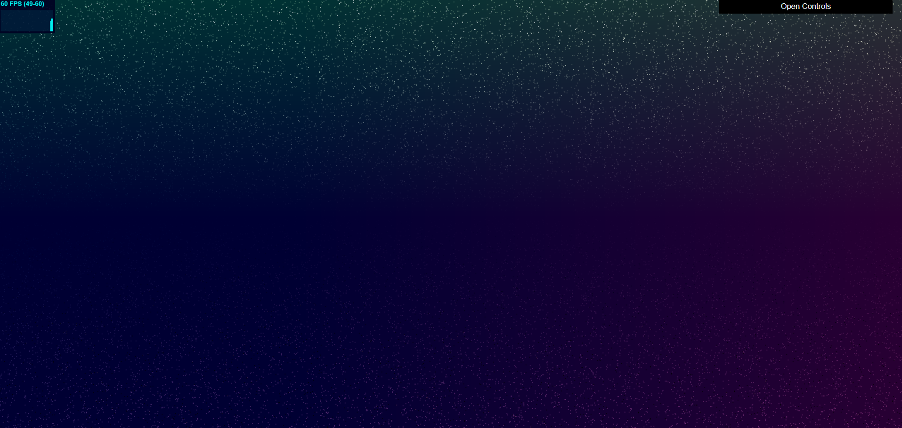
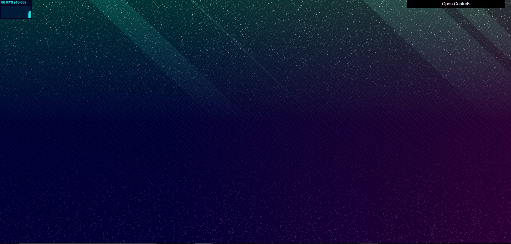
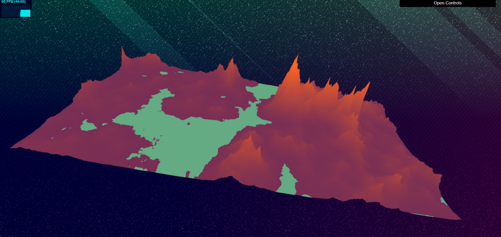
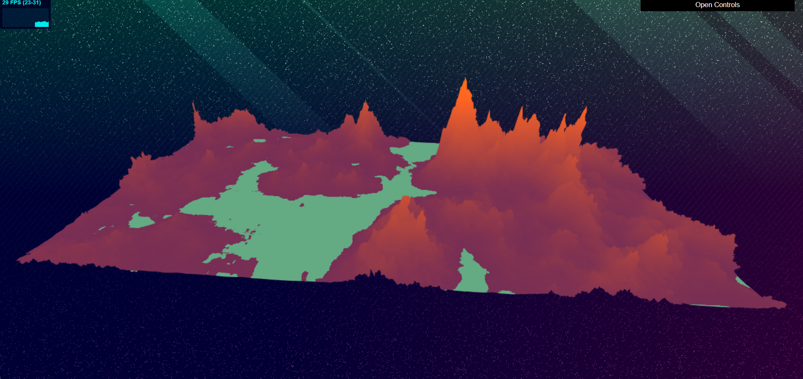
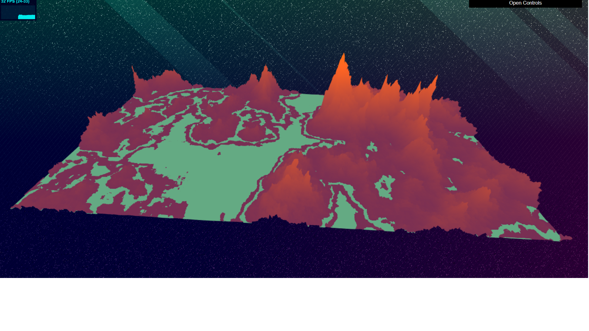

# Noisy Terrain
**By Janine Liu / jliu99**

# External Resources

In addition to the class lectures and powerpoints, I consulted a few external resources for this project:
- http://iquilezles.org/www/articles/warp/warp.htm, for implementing a perturbed FBM function.
- https://static1.squarespace.com/static/58a1bc3c3e00be6bfe6c228c/t/58a4d25146c3c4233fb15cc2/1487196929690/ImplicitProceduralPlanetGeneration-Report.pdf, for approximating the gradient of a surface.

# Live GitHub demo
https://j9liu.github.io/hw1/

# Sky Features

The sky is a superposition of several simple functions, each of which is responsible for a different layer of the background.

First, all the pixels were colored based on a linear gradient between a blue and a purple hue.
linearly interpolated with the colors corresponding to the normals of the background plane's points.

Then, to produce the cartoon light rays, I experimented with an FBM noise function raised to an arbitrary exponent, which generated the overall placement of the rays based on the coordinates of the plane. The diagonal shape comes from adding the x and y coordinates together, and the angle of their slant is controlled by transforming the domain (multiplying these coordinates by scalars). The amount of light added is affected y coordinate, such that it fades out as it travels down the screen, ultimately cutting off at the half-way point.

The stars came from a custom hardcoded noise function that was called multiple times, both on the xy-coordinates and itself. I used two arbitrary thresholds to filter the amount of dots that appeared for two "layers" of stars, to create slight variation between their brightness.

Lastly, the smaller lines running through the sky were achieved in a similar way as the cartoon light rays. However, it is based on a custom noise function instead of the FBM, so there is no linear interpolation between values. Because of this, there are notable holes in these lines, as opposed to the solidness of the light rays.

Layering all of these effects on one another produces the stylistic night sky in the background.

# Terrain Features

The terrain is meant to simulate a rocky, alien-esque landscape with its own (suspiciously colored) "water." I began with a typical 2D FBM function, which I then raised to an arbitrary exponent in order achieve mountains that towered notably over low-ranged areas. The base color of the mountains was achieved by linearly interpolating between a purple and orange hue, based on the height, while areas corresponding to the "water" were colored based on being below a height threshold.

Since the standard shape of the FBM function showed fairly obviously throughthe mountains, I used more noise to vary the texture of the terrain. For all of the points above a certain height (so the land near the water wouldn't be distorted), I calculated the approximate gradient of the point, then used a perturbed FBM function to generate a noise value that determined how far along the gradient the point would be transformed. This resulted in more rocky, jagged mountains.

Since the pools of water were also fairly straightforward in appearance, I took all terrain that fell between a chosen height threshold and manually flattened them into rivers. This formed streams that followed the outline of the land while leaving some smaller strips of land for a somewhat marsh-like appearance.

